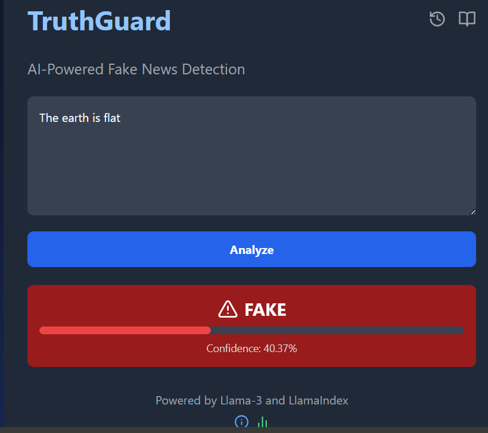

# TruthGuard: AI-Powered Fake News Detector

## Project Overview
TruthGuard is an AI-powered system designed to combat fake news through advanced AI and content moderation. The project leverages technologies like Llama 3 to distinguish between authentic and misleading information in real-time across digital platforms. This README focuses on the backend implementation of the project.



## Key Features
- Real-time detection of fake news using AI algorithms
- Content moderation to ensure trustworthy information dissemination
- User-friendly interface for seamless interaction and feedback (frontend implementation)

## Technology Stack
- Python 3.11
- Flask (Web Framework)
- Together AI (Llama 3 model)
- Pandas (Data manipulation)
- Scikit-learn (Machine Learning)
- LlamaIndex (Knowledge graph system)
- Milvus (Vector Database)

## Setup and Installation
1. Clone the repository
2. Install required dependencies:
   ```
   pip install -r requirements.txt
   ```
3. Set up environment variables:
   - `TOGETHER_API_KEY`: Your Together AI API key

## Usage
To run the Flask application locally:
```
python app.py
```

The server will start running on `http://localhost:5000`.

## Testing the API
You can test the API locally using Postman or any API client. Additionally, the backend is deployed on Render and can be accessed at:
```
https://truthguard-ai-fake-news-detection-with.onrender.com
```

### Local Testing with Postman:
1. Open Postman.
2. Create a new POST request to:
   ```
   http://localhost:5000/classify
   ```
3. Set the request body to JSON format with an "article" key containing the news text:
   ```json
   {
     "article": "Your news article text here"
   }
   ```
4. Send the request and check the response.

### Deployed API Testing:
1. Open Postman.
2. Create a new POST request to:
   ```
   https://truthguard-ai-fake-news-detection-with.onrender.com/classify
   ```
3. Set the request body to JSON format with an "article" key containing the news text:
   ```json
   {
     "article": "Your news article text here"
   }
   ```
4. Send the request and check the response.

## API Endpoints
- `/classify` (POST): Classify a news article as real or fake
  - Input: JSON object with an "article" key containing the news text
  - Output: JSON object with a "classification" key indicating "real" or "fake"

## Model Training
The Llama 3 model was fine-tuned on the [WELFake](https://www.kaggle.com/datasets/saurabhshahane/fake-news-classification/data) dataset using Together AI's platform. The fine-tuning script is available in [fine_tune_llama3.py](./fine_tune_llama3.py).

## Future Enhancements
- Implement the KNN model and RAG pipeline as described in [fake-news-detection-full-code.py](./fake-news-detection-full-code.py)
- Integrate Milvus vector database for efficient similarity search
- Expand the system to handle multiple languages
- Implement user feedback mechanism for continuous learning

## Team
- **Reema Memon** - NLP Engineer (Team Lead)
- **Sami Raza** - AI Developer
- **Letlhogonolo Fanampe** - AI Specialist
- **Wajahat Ali Hassan** - Backend Developer
- **Muhammad Qasim** - Frontend Developer
- **Muhammad Hassan** - Full Stack Developer

## Contributing
Contributions to improve TruthGuard are welcome. Please follow these steps:
1. Fork the repository
2. Create a new branch
3. Make your changes and commit them
4. Create a pull request

## License

This project is licensed under the MIT License. See the `LICENSE` file for details.

## Contact
For more information, please contact:
- **Letlhogonolo Fanampe**
  - Email: Lfanampe@gmail.com
  - GitHub: [djpapzin](https://github.com/djpapzin)
  - LinkedIn: [linkedin.com/in/djpapzin](https://linkedin.com/in/djpapzin)

Thank you for your interest in TruthGuard!